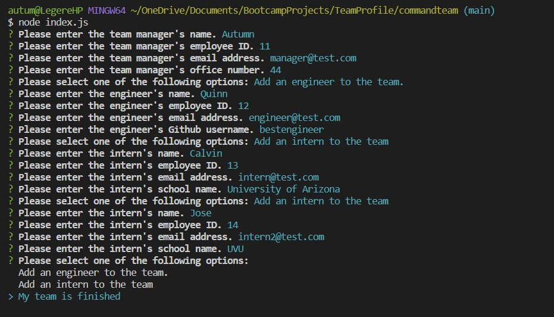
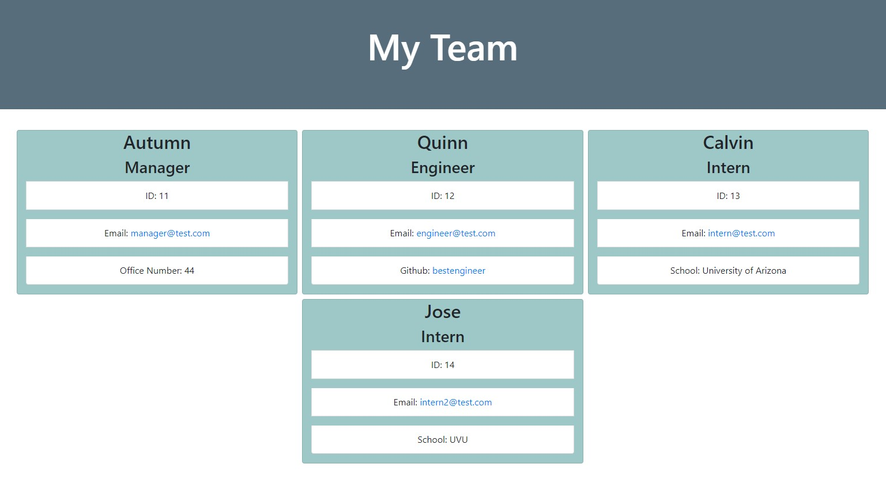

# Command Team - Team Profile Generator
 
## Description
 
This is a command-line project that will take user input about their team members and turn it into an html page. The project makes it much easier to assemble a web page with information about your team so that the data can be easily viewed and understood. Each time the user's team changes, the program can be run again with the new information, which makes it easy to keep everything up to date and relevant. THis project was build using css, javascript, node.js, inquirer(npm), and jest(npm).
 
 
## Usage
 
To use this project simply download the content, open the terminal for the index.js file, and type 'node index.js'. Answer each command line prompt, add as many engineers and interns as you need, and then an html file will be automatically generated for you. The new html file can be found under the dist folder.
 
 
## Link to Project Github
 
[github.com/autumnlegere/commandteam](https://github.com/autumnlegere/commandteam)

## Video Demonstration

 
 
## Screenshot
 
Here are 2 screenshots of the project. One of the command line, and one of the finished HTML file.

 
 
## Credits

- Code for pushing saved instances into empty array  
    - [github.com/JamesLJenks](https://github.com/JamesLJenks/10_OOP-Team-Profile-Generator)

- Code for opening github link in new tab  
    - [www.freecodecamp.org](https://www.freecodecamp.org/news/how-to-use-html-to-open-link-in-new-tab/)

- Code for mailto: for email  
    - [www.tutorialspoint.com](https://www.tutorialspoint.com/html/html_email_links.htm)

- Code for removing commas between mapped objects (.join)  
    - [stackoverflow.com](https://stackoverflow.com/questions/45812160/unexpected-comma-using-map)

- Code for opening mailto: in new tab  
    - [css-tricks.com](https://css-tricks.com/all-about-mailto-links/)